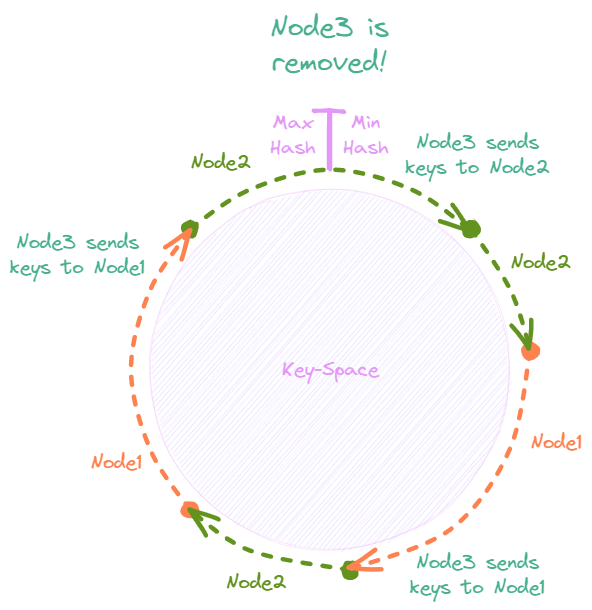

# Sharded KVS

A simple in-memory key-value store capable of sharding data across multiple storage nodes to improve scalability and performance. It supports dynamic addition and removal of storage nodes by repartitioning data across nodes using consistent hashing.

## Overview

Sharded KVS is a Go HTTP [server](server.go) that can be run on any number of storage nodes which communicate with each other to store and retrieve data. Keys can be get, set, and deleted via the HTTP endpoint `/kvs/keys/[key]`.

<p align="center">
    
</p>

Each key-value pair is only stored on a single node. If the node does not have the data it will contact the node that does.

Nodes can be added and removed dynamically while the system is running. To do this a PUT request must be made to the `/kvs/view-change` endpoint with the new `view` for the system. Keys will be repartitioned automatically.

## Setup

### Dependencies

* Go 1.13
* Docker

### Running

Storage nodes for Sharded KVS can be run easily inside Docker containers. Each node must have its own IP address set as an environment variable. It must also have a list of all IP addresses for nodes in the initial `view`. They must be in the same order for every node.

```
$ docker run -d -p 13801:13800 --net=sharded-kvs-subnet --ip=10.10.0.4 --name="node1" 
  -e ADDRESS="10.10.1.0:13800" -e VIEW="10.10.1.0:13800,10.10.2.0:13800" sharded-kvs:1.0
```

A [script](test/create.sh) is provided to create docker containers with this format.

### Testing

See [test/test1.sh](test/test1.sh) for an example of how to start and query the kvs.

```
cd sharded-kvs/test;
chmod +x *.sh;
./test1.sh
```

## Design

### Initialization

To initialize the system all initial storage nodes are started with an environment variable setting the initial `view`. This is an allow-list of IP addresses for nodes included in the system. If other nodes not in the list are running they will not be allowed to join.

The first node in the list will be the setup coordinator. All other nodes will contact it to receive a running configuration containing which `tokens` in the key-space they are responsible for. Once all nodes in the initial view list have registered with the setup coordinator the system can begin processing queries.

### Sharding

The key-space needs to be partitioned between the available storage nodes in a deterministic way such that each key-value pair belongs to a single node. It should also be partitioned in a stable way so that addition or removal of a node does not require significant repartitioning. Finally, the sharding should be balanced so that each node holds aproximately the same number of pairs.

Consistent hashing is used to satisfy these requirements. The key-space is divided into many `tokens` and each `token` is assigned to a node. The number of `tokens` is much greater than the number of nodes to improve distribution balance of keys between nodes.

<p align="center">
    
</p>

A node stores all keys between any of its `tokens` and the following `token`. Finding the `token` for a given key requries a binary-search traversal of the token list. Since every node is aware of the complete token list all queries will require at most 1 redirect.

### View Changes

Storage nodes can be dynamically added or removed using a `view` change. Multiple nodes can be added and removed in a single view-change. A view change request can be made to any node. The node which receives the request becomes the view change coordinator.

The coordinator compares the new `view` to the existing `view` and determines which nodes were added and removed. If a node is removed all of its tokens are removed and keys are pushed to the previous token in the list. If a node is added then new tokens are randomly added and keys matching those new tokens are pushed to the new node. 

<p align="center">
    
</p>

The coordinator computes all tokens that are changed and notifies all affected nodes. Once all nodes are aware of the new view and all affected keys have been pushed the view change is complete. Since only directly affected tokens need to have their keys resharded the effectively minimum number of keys are moved during a view change making the partitioning very stable.

### Issues

* Fault-tolerance - there is no replication so if a node is unavailable so are its keys.
* View changes cannot occur unless all nodes are available and agree.
* Other operations cannot occur during a view change.
* If multiple requests are made to the same node simultaneously [Golang maps](https://golang.org/doc/faq#atomic_maps) are unsafe.

## Acknowledgements

 This project was completed as part of coursework for [CSE 138: Distributed Systems](https://courses.soe.ucsc.edu/courses/cse138/).

## Links

* [AWS Dynamo](https://www.allthingsdistributed.com/files/amazon-dynamo-sosp2007.pdf)